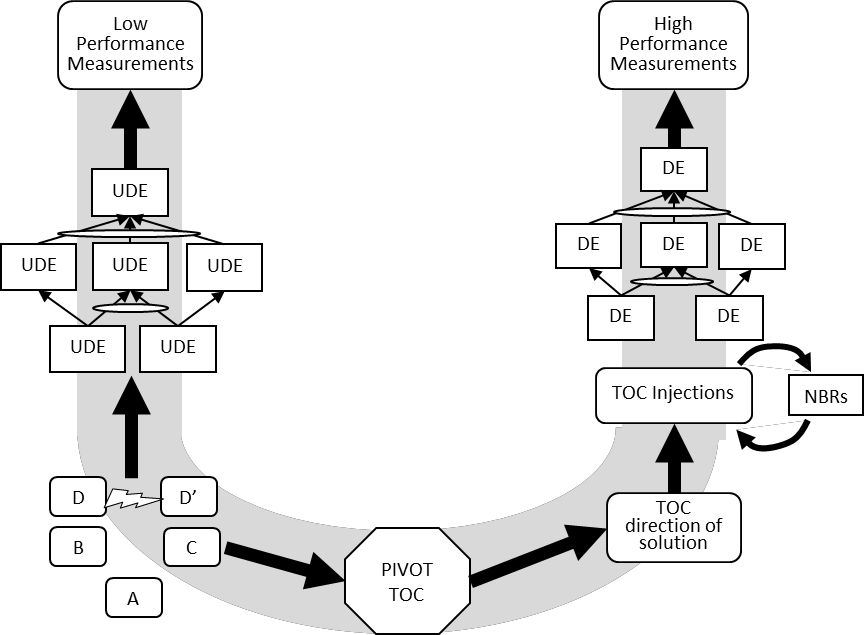

### U-образная форма (U-shape)

**U-образная форма (U-shape)** - диаграмма, иллюстрирующая объекты TOC, участвующие в анализе текущей реальности, а также построении и использовании решения для создания улучшенной будущей реальности.

Использование: U-образная форма была создана для организации, хранения и легкого извлечения знаний ТОС. U-образная форма используется для типовых решений TOC, таких как изготовление на заказ, изготовление с учетом доступности, управление проектами критической цепи и распространение, а также разработка маркетинговых предложений. U-образную форму также можно использовать для облегчения обсуждения вопросов в последовательности вопросов об изменении.

#мп

*Примечание ИА: общая внимание на "Pivot TOC" перевод слова Pivot:*

*стержень (для вращения)*

*pivot - translation options:*

*глагол*

*вращаться: rotate*

*поворачиваться: spin*

*прилагательное*

*поворотный: swivel*

*опорный: supporting*

*стержневой: rod*

*существительное*

*м стержень: rod, hinge, pin*

*точка опоры: fulcrum, pivot point, turning point*

*ж ось: axis, axis of rotation*

*м поворот: rotation*

*м центр: center*

*ж цапфа: trunnion*

*ведущий элемент: pivot element*

*точка вращения: point of rotation*

*центр вращения: center of rotation*

*pivot - examples:*

*прилагательное*

*поворотный кронштейн: pivot mount*

*шарнирная опора: pivot bearing*

*опорная нога: pivot foot*

*существительное: центральная ось*

*То есть Pivot - в т.ч. точка опоры, точка приложения усилий для рычага Архимеда.*

*Эти смыслы в том числе заключены в термин. Не только разворот, или прорывное решение, но и точка приложения усилий.*

*см.:* *точка рычага Архимеда*

Синоним: [[U-shape]].

#translated
