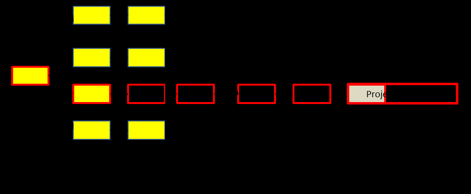
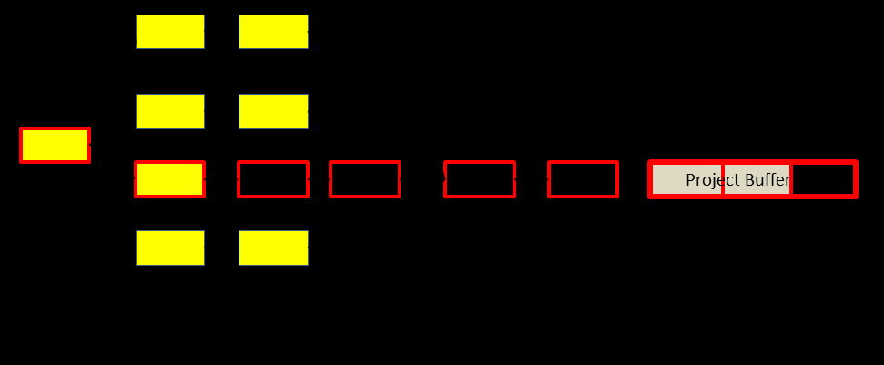

См.: [[скорость сжигания буфера]].

#shortcut

#tocico

## buffer burn rate

<b>buffer burn rate</b> - - A measure of the overall rate at which the project buffer is being consumed for the project to date.  The second measure of a set of three measures in buffer management for single- and multi-project critical chain project management.  
buffer burn rate  =
 percentage of project buffer consumed 

  percentage of critical chain completed   

Usage: The buffer burn rate is used to answer the questions: Is overall progress on the project satisfactory? What is my current project status?  A buffer burn rate of 1.0 or less is good.  The first measure of project status is percent of the critical chain completed; the third measure is the project buffer consumption rate. 

12 
Example:  The three measures of project progress are illustrated in the networks below, which show a project with a six week long critical chain (tasks outlined in heavy lines).  Each task in the project takes one week.  The first measure of project progress is percent of the critical chain completed.  In this case, two weeks (shaded tasks) or 33% (2 weeks/6 weeks) of the critical chain tasks have been completed.  Is this good or bad?  The second and third measures must be analyzed to determine this answer.  Suppose all tasks have progressed as estimated except task X and the resource is stuck on that task.  The second measure of project progress is buffer burn rate, which at the end of week 3 is (33%/ 33%), or 1.0.  One third of the project buffer has been consumed while one third of the critical chain has been completed.  There is no problem at this point in the project as the rate of buffer consumption is equal to the rate of critical chain consumption.

The network below shows the status of the same project at the end of week 4 and the resource is still stuck on task X.  At this point 67% of the project buffer has been consumed while the same 33% of work on the critical chain has been completed.  The buffer burn rate is now (67%/33%) or 2.0.  This is one indication that the project is in trouble.  The third measure of project progress, the project buffer consumption rate, shows that the project is consuming project buffer at the rate of one week for every week of work.  The ideal consumption rate is for every three time periods, two periods should be critical chain task work completed and one period of project buffer consumption.  Since no critical chain work was completed while another week of project buffer was consumed, the project is in serious trouble and immediate action should be taken to bring the project back on schedule.

13 
 See:critical chain completed, project buffer consumption rate, project management measures.

