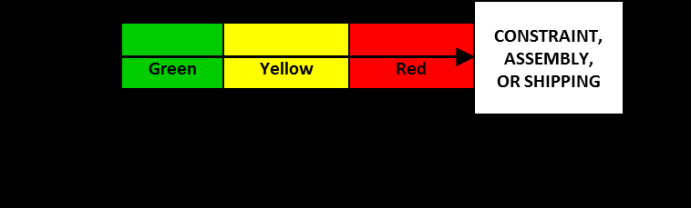
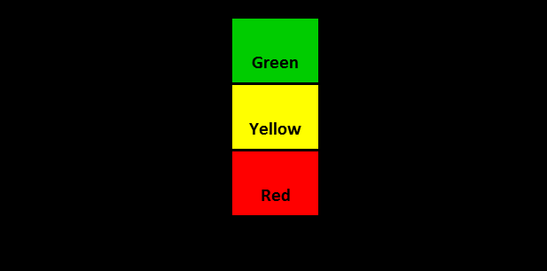

См.: [[диспетчер буферов]].

#shortcut

#tocico

<b>buffer manager</b> -  - The person who is responsible for periodically checking buffer status and managing specific buffers, including establishing buffer sizes and locations, monitoring buffer status daily and communicating corrective actions required to maintain the buffers.  The person is also responsible for 

15 
recording the causes of buffer penetration into the yellow, red and black zones. These causes are used to identify areas to be targeted for process improvements.  identify areas to be targeted for process improvements.  

See:[[buffer management]].
