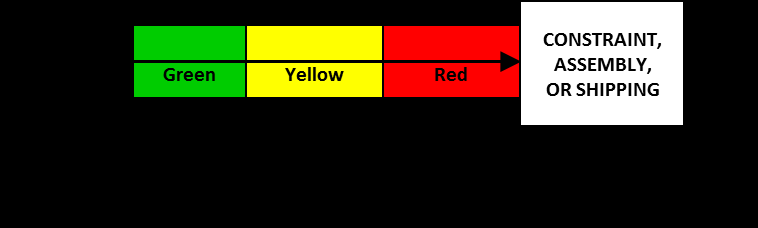

См.: [[проникновение буфера]].

#shortcut

#tocico

## buffer penetration

<b>buffer penetration</b> - - 1. In make-to-order drum-buffer-rope, simplified drum-buffer-rope, and supply chain, an indication of the location of a hole in a time buffer.

Usage:  Buffer penetration for a work order is indicated by stating in which region of the buffer the hole for the work order is located. 

Illustration:
A work order is not yet present in the red zone of the buffer  -  it has penetrated the red zone. 
 
2. In make-to-availability, a measure of the level of finished goods inventory (raw materials and work-in-process) not in the buffer relative to the buffer target level for a stock buffer. 

Usage: Buffer penetration for a given end item is an indication of the level of finished goods relative to the target buffer level for the item.

Illustration: If the level of finished goods for an item is 60% of the buffer target level, buffer penetration is 40% and is said to be in the yellow zone of the buffer. 
3. In critical chain project management, a measure used to monitor the status of a project.  The amount of buffer consumed at any point in time expressed as a percentage of the total buffer. 

Usage: When a task or chain of tasks is not complete and the total elapsed time since start (or release) of the project is longer than the (cumulative) estimated time(s), the expected completion time extends into, or penetrates, the associated feeder or project buffer.  The higher the buffer penetration percentage is the less remaining protection for the project.  Example: Suppose 10 of the 25 days of project buffer have been consumed.  The buffer penetration is 40%, which is in the yellow zone.  Penetration in the yellow zone causes the buffer manager to investigate the situation and, if necessary, plan what action to take if penetration reaches the red zone.  Buffer burn rate is used to judge whether the buffer penetration is serious enough to require action. 

16 

See:[[buffer]], [[buffer burn rate]], [[buffer hole]], [[buffer management]], [[buffer status]], [[critical chain project management]], [[green zone]], [[red zone]], [[yellow zone]].
