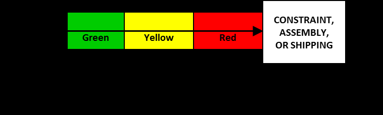

См.: [[скорость реакции буфера]].

#shortcut

#tocico

<b>buffer responsiveness</b> -  - A characteristic of buffers that describes how quickly the size of the buffer and, in some cases, the boundaries between buffer regions, is adjusted as a function of the variability of demand for the item in the buffer.  
Usage: Buffer responsiveness is determined by the buffer manager.  If the buffer target is adjusted quickly in response to changes in demand for the item, the buffer is considered responsive. Buffer target adjustments need not be symmetrical as more damage is caused by lost sales than by carrying excess inventory for a brief time period.  Example: An item remaining in the red for two replenishment periods might trigger increasing the buffer max by one third while a buffer remaining in the green for three replenishment periods might trigger reducing the buffer max by one third.  An item for which a rapid increase in demand or obsolescence is likely might be an exception to the rule and have symmetrical trigger points. Items may be categorized based on the need for buffer responsiveness to demand changes and buffer rules for each category established.  
 

17 

