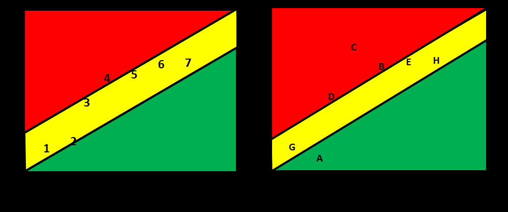

См.: [[состояние буфера]].

#shortcut

#tocico

## buffer status

<b>buffer status</b> - 1.In make-to-order drum-buffer-rope, simplified drum-buffer-rope, and supply chain, a measure of the relationship between the time available to complete an order and the standard production lead time, determined as follows:   
buffer status (%) = (available time) / (standard production lead time) x 100% 
 

Usage:  Buffer status is used to determine whether expediting is necessary for an order.  Although there are not fixed percentages for the three regions of the buffer, many times the buffer is divided into three equal regions.  In this case, if the buffer status for a work order is between 67 and 100%, the order is assigned the color green indicating that normal progress is being made therefore no action is necessary.  If the buffer status is between 33 and 67%, the color yellow is assigned, which indicates that less than normal progress is being made therefore plans should be made for expediting the order.  If the buffer status is between 0 and 33%, the color red is assigned, indicating that the order has fallen behind schedule therefore the expediting plans should be executed immediately.  

Illustration:  A time buffer for a work order is shown below.  The buffer status is approximately 20%, so the order is in the red zone.  
2. In make-to-availability, a measure of the level of finished goods (raw material and work-in-process) inventory of a part compared with the buffer target level.  

Usage: When the finished goods contains two-thirds or more of the target level, the buffer status is green; between one-third and two thirds the status is yellow; and between zero and one-third it is green.  The cutoffs of one-third and two-thirds are common but other cutoffs are also used.  

Illustration:  A stock buffer for an SKU is shown below.  The buffer status of the part is yellow.

 3. In make-to-availability, a measure of the priority of a work order. 

Usage:  The buffer status of a work order in process is based on the number of units, stated as a percent of the target level, that are downstream from the work order.
Example:  If the target level for a part is 600 units and there are 150 units in finished goods and 100 units in process downstream from order 123, then order 123 has a buffer status of (150+100)/600 X 100% = 41.67%, which is generally considered to be in the yellow region.  
4.  In critical chain, a measure of the project buffer consumed in relation to the proportion of the critical chain completed.

18 

Usage:  The buffer status of a project has to be adjusted for the amount of the critical chain completed. The color associated with the buffer status is determined by the amount of the buffer penetration in relationship to the progress of the project as denoted by the amount of critical chain completed. The slopes of the green and yellow zones are determined by the user.  
Fever charts are useful for indicating buffer status in both single and multi-project environments. In 
a single project environment, the status of the project is plotted periodically (for example weekly) to show the relative status of the project to the remaining protection.  If a project is in the red early in the project then the project manager may want to take immediate action to bring it back to the yellow or green status before his/her actions become limited.  In a multi-project environment, a program manager can use the multi-project fever chart to determine which projects are in trouble (red region) with respect to remaining buffer protection and allocate resources across projects to bring the troubled projects back in the yellow or green zone. 

See:[[fever chart]].
