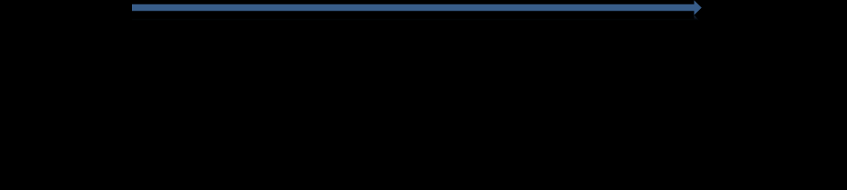

См.: [[одобрение]].

#shortcut

#tocico

## buy-in

<b>buy-in</b> -  - A rigorous process of leading a group to full consensus on a solution.  The process is designed to overcome the 'layers of resistance'. The steps are the following: 1. Agree on the problem. 2. Agree on the direction of the solution. 3. Agree that the solution solves the problem. 4. Agree that the solution will not lead to any significant negative effects. 5. Agree on the way to overcome any obstacles that might block or distort implementation of the solution. 6. Overcome unverbalized fears. 

See:[[change analogy]], [[layers of resistance]], [[minus-minus buy-in process]], [[plus-plus buy-in process.   
   20]].
