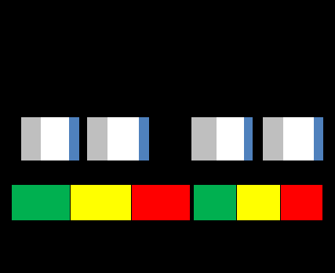

См.: [[буфер ограничения]].

#shortcut

#tocico

## constraint buffer

<b>constraint buffer</b> - The time buffer offset used to schedule the release of materials that feed the constraint. 

Usage: If a constraint exists in production, a constraint buffer and a shipping buffer (and sometimes an assembly buffer) are used to protect the output of the system. If the constraint is in the market, the constraint buffer is unnecessary and only the shipping buffer is used. The constraint buffer is not used in simplified drum-buffer-rope.  The constraint buffer is sized to significantly reduce the likelihood that variation in the system prior to the constraint will cause the constraint to "starve", (i.e., not have what it needs in order to meet customer demand), yet will not result in excessive work-in-process inventory. 

Perspective: The TOC approach of buffering the constraint is a major difference from many other production management approaches. This difference is important because if there is a constraint in 

29 
operations, this buffer enables the system to more fully exploit the constraint, thereby increasing throughput.

Illustration: A constraint buffer for a make-to-order production situation is shown below: 
 

See:[[buffer]], [[buffer management]], [[shipping buffer]].
