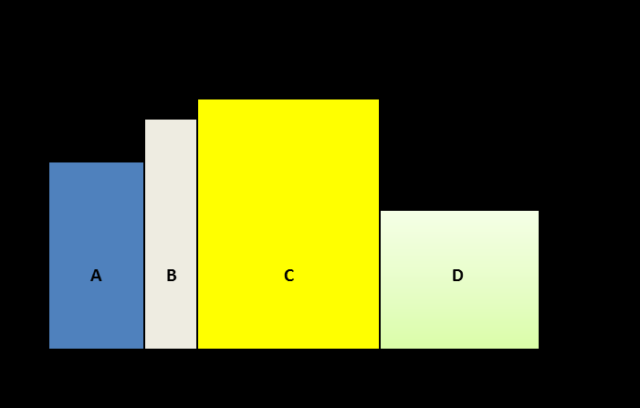

См.: [[основная проблема]].

#shortcut

#tocico

## core problem

<b>core problem</b> -  - A part of the current reality that is directly responsible for (i.e., is the source of) the existence of the most significant undesirable effects in the current reality of the system being studied.  There may be one or more core problems, however, generally one to three core problems will account for over 70% of the UDEs in an environment. 

Illustration:  In the CRT below, entity 10 is a core problem:  

33 
 
  Perspective 1: A core problem can have one of three manifestations, either as: 1. a fact and entity in reality, such as "Efficiency is used as the prime measure in operations." that can be directly linked through cause-effect relationships to the majority of the UDEs, or 2. the conflict between D and D' in a core conflict cloud, such as D Use local efficiencies as a prime measure and D' Do not use local 

34 
efficiencies as a prime measure, or 3. an erroneous assumption responsible for the conflict, such as A resource standing idle is a major waste.  The core conflict cloud can also be a manifestation of the core problem.  When identifying a core problem in a CRT, it is important to realize that because not all UDEs are equally important, and because the identified UDEs used to create a CRT do not include all UDEs, the 70% rule is only a guideline intended to ensure that the entity or entities identified as core problems are the source of most of the significant UDEs. 
When declaring a fact or an erroneous assumption as a core problem it is important to realize that the 
core problem can be chosen subjectively.  In reality there can be more than one core driver that is responsible for the existence of over 70% of the UDEs.  The person conducting the study can choose one of these core drivers as a core problem subject to level of authority and/or personal stamina to address the cause.  Perspective 2:  A core problem can be defined at four levels connected through cause and effect. The lowest level is an erroneous assumption about reality that blocks the individual or organization from breaking their core conflict. The second level is the policies that are a consequence of the erroneous assumption (e.g. a policy to decide which side of the conflict to focus on (D or D'), when to switch (As long as …do D…as soon as …do D'….) or even not to take any action now (maintain status quo) since there are negatives associated with both D and D'. The third level is the measurements we put in place to ensure the policies are adhered to while the fourth level is the "bad" behaviors that result from the erroneous assumptions, (local optima) policies and/or measurements.  

See:[[assumption]], [[core conflict]], [[core conflict cloud]], [[core driver]], [[current reality tree]], [[undesirable effects]].
