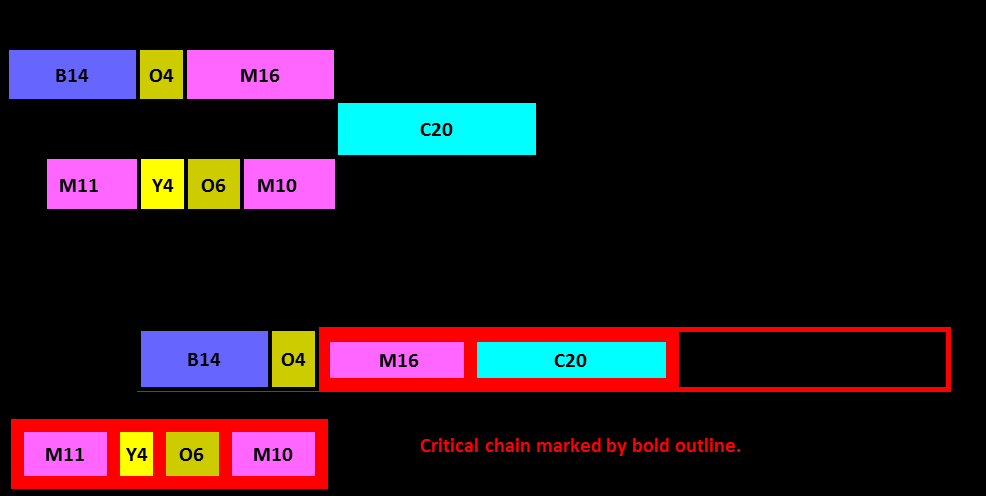

См.: [[диаграмма использования затрат]].

#shortcut

#tocico

## cost utilization diagram

<b>cost utilization diagram</b> -   (CUT diagram) - A histogram that compares the utilization or load of each of the organization's resources with its cost.  The height of the bar for each resource indicates its utilization and the width indicates its cost. 

Illustration:

35 

