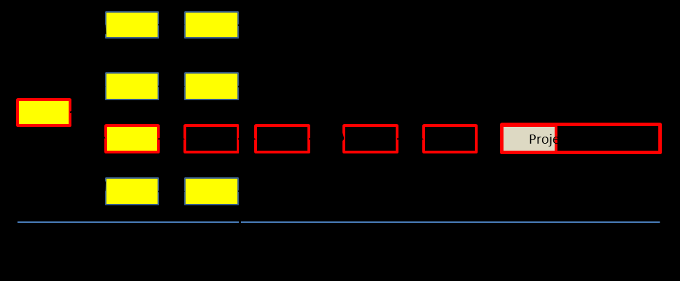

См.: [[критическая цепь]].

#shortcut

#tocico

## critical chain

<b>critical chain</b> -  The longest sequence of dependent events through a project network considering both task and resource dependencies in completing the project. The critical chain is the constraint of a project. 

Usage: The project duration is the total of the critical chain task times plus the project buffer.  

Illustration: The project below has eight tasks and one unit of each of five resources (B, C, M, O, and Y).  Tasks M16 and M10 require resource M at the same time, an example of resource contention.  One option is to start task M10 earlier to eliminate the contention.  Once this is done, the critical chain becomes M11-Y4-O6-M10-M16-C20.  This sequence of tasks plus the project buffer (PB) of 33 days determines the critical chain duration of 100 days (although see the Caution below about the length of the critical chain).  
 

Caution:  Internal  organization  functions  (e.g.,  resource  managers,  project  managers,  software 
developers)  use  the term  critical  chain  to  describe  the  unbuffered  or  unprotected  chain  of  dependent tasks/resources.  In contrast to this usage, sales, marketing and other functions that deal directly with clients  use  the  term  critical  chain  to  describe  the  total  project  duration,  which  includes  not  only  the total task time on the critical chain but the project buffer also. This total project duration provides the 

36 
basis  (adjusted  for  starting  date)  for  promising  project  completion  dates  to  clients.
Goldratt,  in  his summary  in  Session  3:  Project  Management  and  Engineering  of the  Goldratt  Satellite  Program,  uses the  terms  critical  chain  and  protected  critical  chain  to  describe  the  internal  and  external  uses  of  the term, respectively.

See:[[critical chain project management]], [[protected critical chain]].
