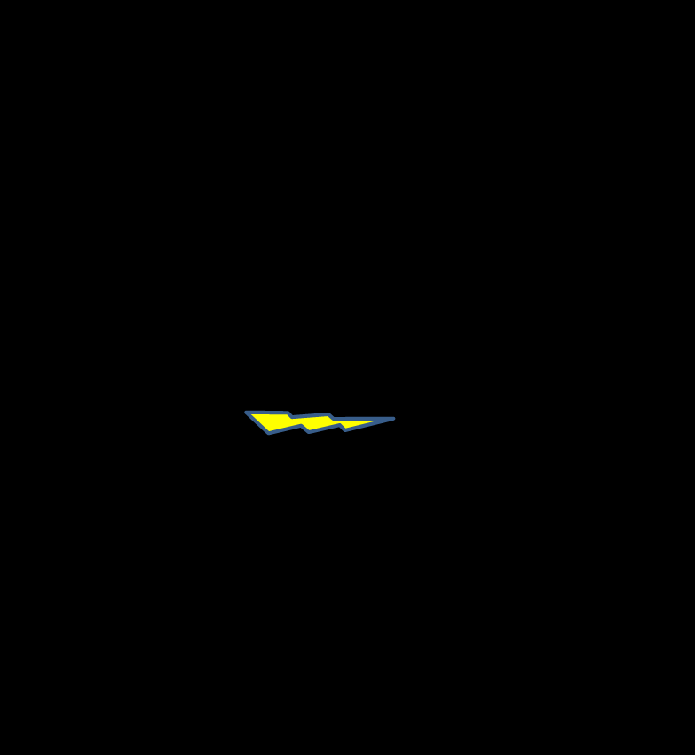

См.: [[дерево текущей реальности]].

#shortcut

#tocico

## current reality tree

<b>current reality tree</b> - (CRT) - A thinking processes sufficiency-based logic diagram that facilitates answering the question (from the change question sequence): "what to change?" by illustrating the cause and effect relationships between the core problem and the undesirable effects (UDEs) in a system. 

Usage: The CRT uses "if.., then..." logic to present unbroken chains of cause-and-effect relationships from the core problem or core conflict upward to the undesirable effects.  It also presents sequences of entities which depict system-based policies leading to measurements, which in turn, are causing undesirable behaviors to occur.

The CRT is often used when: 1. it is not clear how to implement one or more of the five focusing 
steps or, 2. the system improvement team has trouble obtaining managerial buy-in of proposed changes.  By understanding why the UDEs exist, the system improvement team is able to design a set of interventions or injections to eliminate the core problem, and hence, the majority of the most significant undesirable effects. 
There are two approaches to developing a current reality tree - the traditional approach, which starts 
with a list of UDEs and connects them using cause and effect logic, and the three-cloud approach, which starts with three evaporating clouds from which is developed a generic cloud that becomes the basis for the CRT. 

Illustration 1:  Example of CRT developed using the traditional approach: 

40 
 

Illustration 2:  Example of CRT developed using the three-cloud approach:               

41 
  

See:[[buy-in]], [[change question sequence]], [[core conflict]], [[core problem]], [[injection]], [[sufficiency-based logic]], [[thinking processes]], [[three-cloud approach]], [[undesirable effects]], [[what to change?]].
