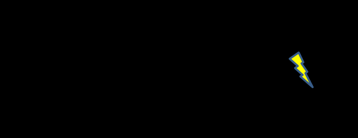

См.: [[желаемый эффект]].

#shortcut

#tocico

<b>desirable effect</b> - (DE)-  A positive or beneficial outcome associated with an organization's actual or future performance.  
Usage: A DE is often the opposite of an undesirable effect (UDE). When appearing in a future reality tree, DEs may be either exact opposites of their corresponding UDEs or they may be conditions that signify that the undesirable aspects present in a current reality tree have been overcome. Example 1: For the UDE "Throughput is declining," the corresponding DE would be, "Throughput is increasing." Example 2: For the UDE "Production lead times are too long," the corresponding DE could be "Production lead times are less than competitors' lead times."
"Production lead times are less than competitors' lead times."

See:[[current reality tree]], [[future reality tree]], [[undesirable effect]].

44 

