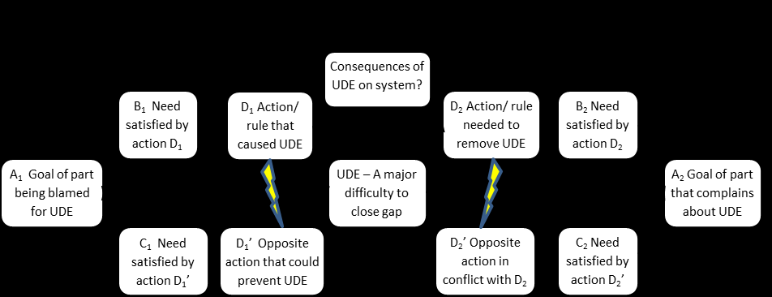

См.: [[сухое дерево]].

#shortcut

#tocico

## dry tree

<b>dry tree</b> - - Colloquial term used to describe any thinking processes logic tree that has been scrutinized for validity  using  the  categories  of legitimate  reservation and is  considered to  be  very  solid  or tight  from  a logical perspective. 

47 

Perspective: Opposite of a "wet tree," which is considered to be not very solid or logically tight. Ant.: wet tree.  

See:[[categories of legitimate reservation]], [[long arrow]], [[scrutiny]], [[thinking processes]], [[wet tree]].
