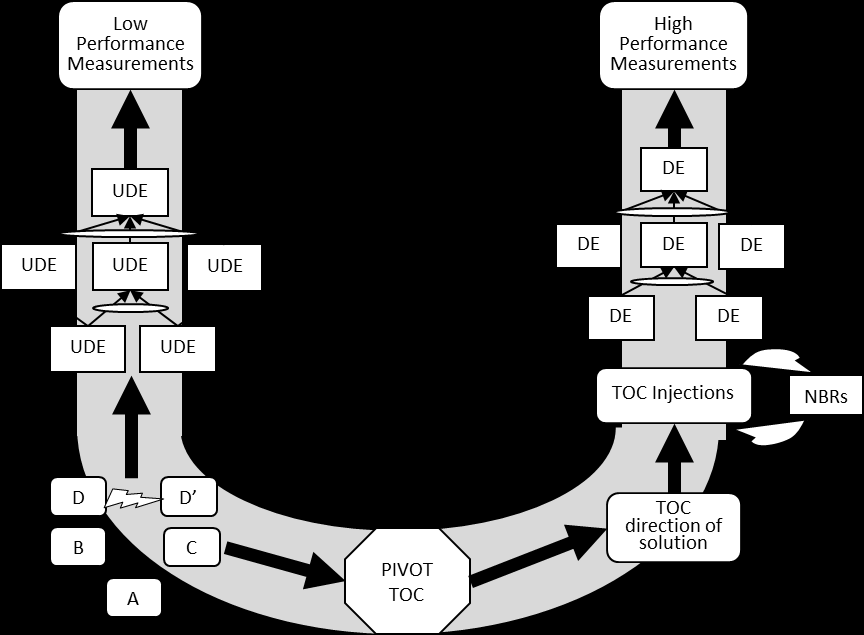

#tocico

<b>U-shape</b> - - A diagram illustrating TOC entities involved in the analysis of current reality and the construction and use of the solution to create an improved future reality.  
Usage: The U-shape was established to organize, store and easily retrieve TOC knowledge.  The U-shape is used for generic TOC solutions such as make-to-order, make-to-availability, critical chain project management, and distribution as well as developing marketing offers.  The U-shape can also be used to facilitate discussion of the questions in the change question sequence.

132 

