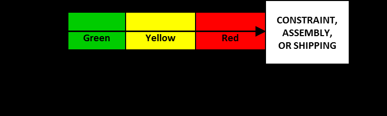

#tocico

# budget buffer

<b>budget buffer</b> -  A portion of the overall project budget set aside to cover uncertainties associated with project costs.

Usage:  Just as safety time is removed from each activity time, safety cost should be removed from each activity cost.  A budget buffer is similar to a project buffer in that the amount set aside for higher than estimated expenses is in reserve to protect the project budget in total.  Similar to the project time 

buffer the project budget buffer should be substantially less than the sum of the individual budget reserves for each activity.
  

Syn.:[[cost buffer]].

