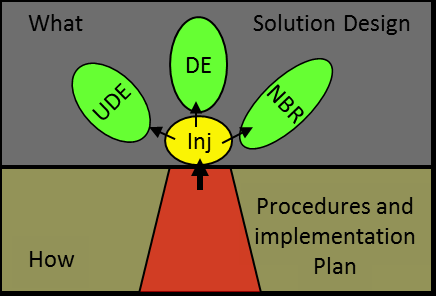

#tocico

<b>independent multi-project environment</b> -  - An environment in which critical resources are not shared across projects.  Projects are managed as multiple single-projects.
 

Syn.:[[multiple single-project environment]].

Syn.:[[multiple single-project environment]].

See:[[dependent multi-project environment.  
   66]].
