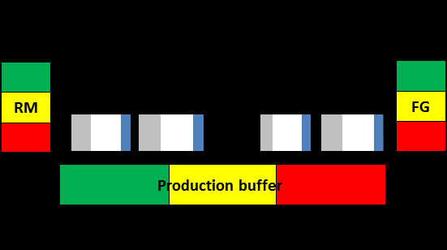

#tocico

# magnitudinal 'and' connector

<b>magnitudinal 'and' connector</b> - - A connector used in sufficiency-based logic diagrams to indicate that two or more entities are independent causes that contribute in an additive way to a total effect.  Each additional cause contributes incrementally to an increasing (or decreasing) effect.  No symbol or a bow-tie shaped symbol is used to represent the magnitudinal 'and' relationship. 

Usage: Generally, independent causes accounting for at least 70% of the magnitude of an effect should be identified.  When this is the case, an effect or problem is reduced significantly if those major causes are eliminated.

The magnitudinal 'and' connector is used in current reality trees, future reality trees, and negative branches.  If the bow tie is used it is drawn to overlap the arrows originating from all additive causes and indicates that the removal of any one cause will degrade the effect by some amount.
To eliminate 

all of a graduated effect, all of the additive causes must be eliminated.  Causes may be selectively eliminated or retained to achieve an acceptable level of effect. 
Frequently, independent arrows entering an entity are interpreted to mean that the entities at the bases of the arrows are independent additive causes.  In logic diagrams in which the magnitudinal 'and' connector is used, two or more independent arrows entering an entity are interpreted to mean that each of the cause entities can account for the entire effect. 

Illustration: The following diagram is verbalized: If 10 We sell our products at a premium domestically and 20 We license production in other countries and 30 We export our products to other countries then 40 We make more money, now and in the future. 
 

See:[['and' connector]], [[conceptual 'and' connector]].
