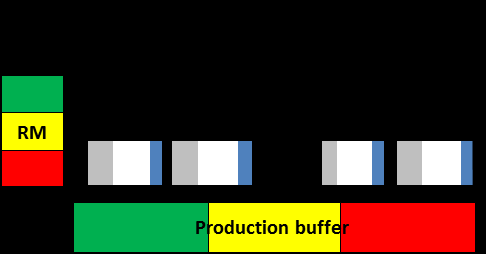

#tocico

<b>make-to-order</b> - (MTO) A manufacturing strategy where an product (good or service) is produced after the customer order is placed. 
Usage 1: When the manufacturing facility has an internal constraint, drum-buffer-rope scheduling is used and buffer management is used to control execution.  The raw materials release date and estimated shipping date are determined by placing the order constraint process at the first open date on the constraint schedule and subtracting the constraint schedule to determine raw material release and adding the shipping buffer to the constraint schedule for the product to determine the shipping date.
Illustration 1:  MTO with an internal constraint: 
 Usage 2: When the manufacturing facility has no internal constraint a production buffer is used for planning with the plant capacity-constrained resource used to plan raw materials release by subtracting one-half of the production buffer from the planned load date for processing the order and by determining customer shipping date by adding one-half the production buffer to the planned load date.  Long lead time raw materials and common (across products) raw materials buffers are commonly used as strategic buffers to reduce lead time. Illustration 2:  MTO with a market constraint:  
 
 

78 
 
 

See:[[make-to-availability]], [[make-to-order injections]], [[make-to-stock]].

