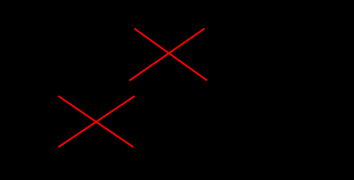

#tocico

<b>predicted effect reservation</b> - - A level III reservation in the categories of legitimate reservation that is used to challenge either an entity's existence or the existence of a causal relationship on the basis of the absence of an inevitable effect that would have to exist if the entity or the proposed causal relationship really existed. 
Usage: The predicted effect reservation can be used to prove or disprove the existence of an entity or a cause-effect relationship that is very difficult, perhaps even impossible to prove by direct observation.
  Predicted effect existence is useful when a hypothesized cause is surfaced for an effect and the cause cannot be proved by direct observation.  However, for the hypothesized cause to exist some other 

93 
effect must be present.  If the predicted effect is present it validates the existence of the hypothesized cause.  Illustration: The existing effect is 30 My car won't start. The hypothesized cause is 20 My car battery charge is low. The predicted effect of a low battery charge is 40 The car lights are very dim. If testing the lights shows that 100 The car lights are bright then the car battery charge must not be low.  Conversely, if the lights were indeed very dim, then support would be given to the existence of the cause that the car battery charge is low. 
 
 

See:[[categories of legitimate reservation]], [[cause-effect]], [[entity]], [[scrutiny]].
