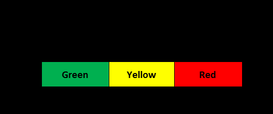

#tocico

<b>production buffer</b> - In simplified drum-buffer-rope, a liberal estimate of the amount of time required to reliably complete production of a work order.

Usage: Due to the unavoidable existence of disruptions in production environments, the time required to reliably complete production will be larger than just the sum of individual production steps.  The production buffer is sized to dramatically reduce the likelihood that variation in the system will cause missing the due date, yet not result in excessive work-in-process inventory.  On average, orders will be completed in about half the length of the production buffer, so an order enters the red zone if it requires more than 33% longer than the average production lead time.  
When an order is placed with a specific due date, the order might have to wait for release to the 
shop floor either due to the current load on the shop floor or due to the fact that from now to the 

97 
customer order due date is longer than the production buffer. This wait time is prerelease production lead time and is not part of the production buffer. Perspective: The simplified drum-buffer-rope approach to buffering is quite different from the lean kanban approach.  While both are pull systems, kanban includes buffers between each sequential pair of work centers while simplified drum-buffer-rope ties the rope from order completion, based on customer due date, to release of raw materials across the entire production process.  This production buffer approach significantly reduces lead time and work-in-process inventories compared to kanban. It also can be used in very complex routings such as job shop environments.
Illustration: 
 

Syn.:[[reliable production lead time]].

Syn.:[[reliable production lead time]].

See:[[buffer management]], [[make-to-availability]].
