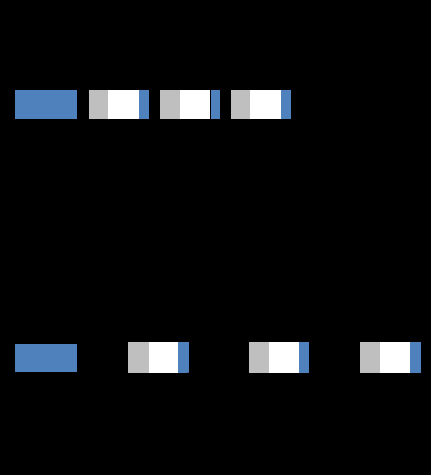

#tocico

<b>production lead time (</b> - PLT)- The total time from when a manufacturing order is released to the shop floor until the order is ready for shipment (make-to-order) or placement in finished goods (make-to-availability).  PLT is comprised of: 1.  Queue time for a machine to be available for the work order (the resource that is needed for the next 
operation is occupied and there is a queue of work orders to be processed);  
2.  Setup time for the assigned machine to get ready to process the specific work order;  3.  Process time - the actual time when the material is being worked on; 4.  Wait and move times occur when an order is completed at one work center and it has to be moved to 
another work center; and 
5.  Protective time to cover for unexpected and unplanned activities, i.e., "Murphy." 
Usage: Order processing lead time (the time to process the customer order at the manufacturer) and prerelease time (the time until release to the shop floor) occur prior to the TOC production lead time.  Placement into the finished goods inventory in a make-to-availability environment marks the end of the production lead time.  Shipment to the customer in a make-to-order environment marks the end of the production lead time.
Illustration:  The first diagram below shows TOC production lead time and the second shows lead time in a traditional production environment.  In traditional production, once order processing is complete the manufacturing order is released to the shop floor regardless of the current load on the shop.  Thus queues, and therefore production lead times, are significantly longer. 

98 
 
 

See:[[replenishment lead time]].
