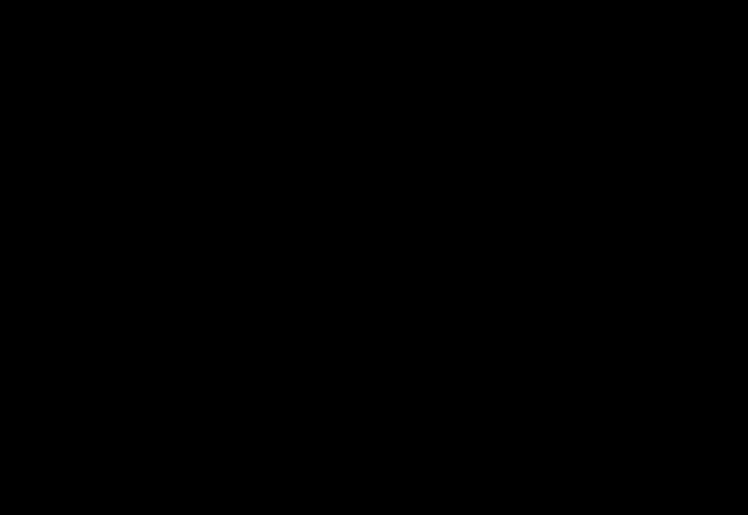

#tocico

<b>strategy and tactics tree</b> - (S&amp;T tree) 1.A thinking process (a logic tree) to define and communicate all the necessary and sufficient changes required to synchronize actions for the achievement of any ambitious 

114 
target (or achieve more goal units), as well as the implementation sequence (from left to right and bottom to top).  2. A hierarchical framework guiding the processes required to cause holistic planned changes in an organization to convert it to an ever-flourishing organization by focusing on the questions of what to change, what to change to and how to cause the change, with emphasis on the third question.  
Usage: The S&amp;T tree can be built using the thinking processes or by using the plus-plus buy-in process.  The S&amp;T tree is the organizer of all the knowledge gained by analyzing an organization using the other thinking processes.  The logical structure of the S&amp;T tree guides organizational focus - starting from the highest objective, the S&amp;T tree logically derives which actions must be taken in which order at all levels of the organization.  An S&amp;T tree provides the roadmap to build, capitalize, and sustain a decisive competitive edge. The S&amp;T tree provides not only the necessary and sufficient conditions for achieving the strategy but also defines the specific changes in focus, measurements, processes, policies and behaviors required at each level and in each function of the organization. Example: The diagram below provides the general framework of an S&amp;T tree.  The level 1 (L1) strategy defines the change in measures and focus that must occur for the CEO.  The L1 tactic defines the change in modes of behavior and rules for the CEO.  Level 2 strategies and tactics address the same issues for VPs and directors.  Level 3 strategies and tactics are for functional managers and Level 4 strategies and tactics are for employees.  S&amp;T trees may contain a Level 5 which provides more details on sequencing and actions.

 
 

See:[[necessary assumption]], [[parallel assumption]], [[strategy]], [[strategy and tactics node]], [[sufficiency assumption]], [[tactic]].
