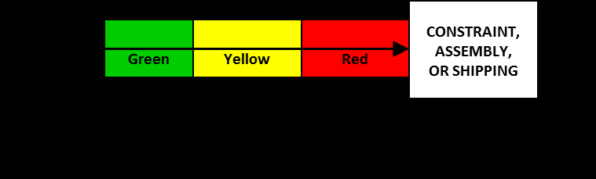

#tocico

<b>throughput-value-days</b> - (TVD)A term used instead of throughput-dollar-days in countries where the dollar is not the base currency. dollar is not the base currency. 

See:[[throughput-dollar-days.   
   123]].
