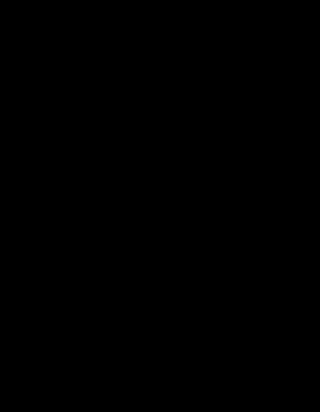

#tocico

<b>transition tree</b> - (TRT) A thinking processes sufficiency-based logic diagram that facilitates answering the question (from the change question sequence) "how to cause the change?" by providing a detailed, step-by-step set of actions that are needed to implement the desired change within an organization.  In creating a TRT, "if…then…" sufficiency logic is used to map the sequence of detailed actions and their rationales that are required to move an organization from its current reality to the desired future reality as specified in the future reality tree.  In particular, the TRT is formed by expanding the elements identified in the prerequisite tree into a more detailed set of needs, current states and future states or intermediate objectives expected, and actions required along with their respective rationales to address or overcome any anticipated obstacles. Two approaches and structures to construct the TRT are used.  The second approach was developed to overcome some of the shortcoming in determining the logical sequence in the first approach.
  
Usage 1: The general structure of the TRT is given in Illustration 1 below.  Actions are indicated by square-cornered boxes and all other entities are in rounded-corner boxes.  At the base of the spine of the TRT is the present situation; at the top of the spine is the objective to be achieved.  The entities in the column between the present and desired objective (bottom to top of diagram) are the transition states (or stages) required to achieve the objective, alternating with the need for the next transition state that the environment should go through in moving from the present to the desired state.  The entities to the right of the transition column gives the logic of why the next transition state is needed, alternating with the logic of why the action will move the environment to that state.  The actions required to move the environment to the next state are on the left of the spine.  The TRT is read as "I want to achieve the <i>desired objective</i>.  Given that the <i>current state</i> exists and that I want to move to the <i>next transition state</i> because the <i>logic of the next transition state</i>, if <i>action</i> is taken the <i>transition</i> will result because the <i>logic of the action</i>."  The next state is read similarly and all others until the desired objective is achieved. Illustration 1: 

127 
  
Usage 2: In the newer approach, the spine of the transition tree leads from the present situation though the need to take a given action, to taking that action, to the need for a second action, to taking that action, etc. until we achieve our objective, intermediate objective, injection or desirable state.  At each transition the need for the action and the working assumption of why this action is needed to move to the next state is provided.  The tree is read: if (action 1) then (appropriate state to take action 2).  If (appropriate state to take action 2) and (need plus working assumption for action 2) then action 2.  These logical steps are followed until the objective is achieved.
Illustration 2:   
 
 

128 
 
 

See:[[change sequence]], [[how to cause the change?]], [[intermediate objective]], [[obstacle]], [[prerequisite tree]], [[sufficiency-based logic]], [[thinking processes]].
