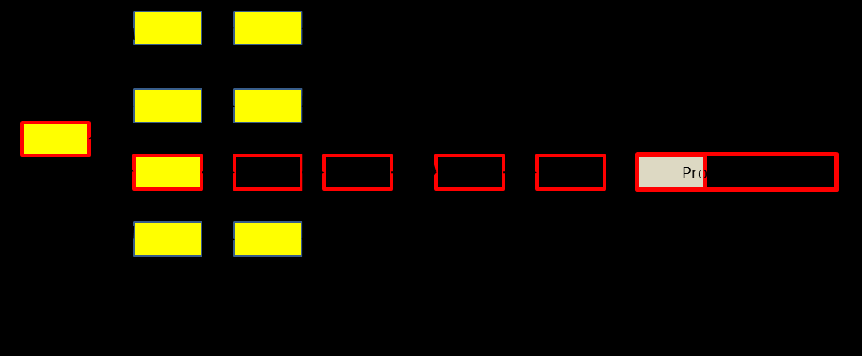

См.: [[уровень потребления буфера проекта]].

#shortcut

#tocico

## project buffer consumption rate

<b>project buffer consumption rate</b> - (PBCR) - A measure of project progress for the most recent reporting period. The third measure of a set of three measures in buffer management for single- and multi-project critical chain project management.  
Project buffer consumption rate =

 Increase in % of buffer consumed this reporting period___

 
Increase in % of critical chain completed this reporting period  

 

Usage: The first two measures of critical chain project management, critical chain completion (%) and buffer burn rate, are overall measures of the project to date.  PBCR, the third measure, provides information about project progress in the most recent reporting period.  The PBCR tells the project manager whether progress on the critical chain in the most recent reporting period was adequate in relation to the amount of project buffer consumed.  PBCR tells the manager whether critical chain tasks during the period are in trouble and whether any corrective actions taken at the beginning of the period (based on the prior period's PBCR) were effective.

Example: In the project network below, the project has 12 tasks of one week each.  The shaded tasks have already been completed.  The un-shaded tasks have not been completed.  The bold outline indicates the tasks on the critical chain and the X indicates a resource that is stuck on a particularly difficult task.  At the end of week 3, the first two  measures for this project are critical chain complete, 
which is 33% (two weeks of the six weeks critical chain has been completed); and the buffer burn rate, which is 1 (one-third of the project buffer has been consumed and one-third of the critical chain has been completed). At the end of week 4 (figure below), the next reporting period, the critical chain resource is still having problems on task X and only made two days of progress on the five-day critical chain task.  Although two days of progress has been made on the critical chain, five days have elapsed on the calendar, so the project has penetrated the project buffer an additional three days.  The PBCR for week 4 is 3.0 calculated as follows:  three days represents a 20% increase in the buffer (3 days/15 days total project buffer) and the two days of progress on the critical chain represents 6.67% of the critical chain (2 days/30 days).  The PBCR is then 20/6.67 = 3.0. 
PBCR shows that in the most recent reporting period the project consumed project buffer faster 
than the critical chain was being completed.  Values of the PBCR greater than 1.0, as in this example, are an indication that the project manager needs to devote attention or resources to the critical chain activity that is causing the elevated PBCR.  If the project buffer is being consumed at the same rate as the critical chain is being completed, the PBCR will be 1.0.  Values of the PBCR of less than 1.0 indicate that the critical chain is being completed faster than the project buffer is being consumed, and a value of zero for the PBCR for a period indicates that the critical chain tasks were completed in the time originally estimated.  Negative values occur in periods in which project buffer is recovered. (Note however, that negative values of the PBCR can also occur in periods in which the remaining duration of the critical chain increases due to changes in task time estimates.) 

See:[[buffer burn rate]], [[critical chain completed (%)]], [[project management measures]].
