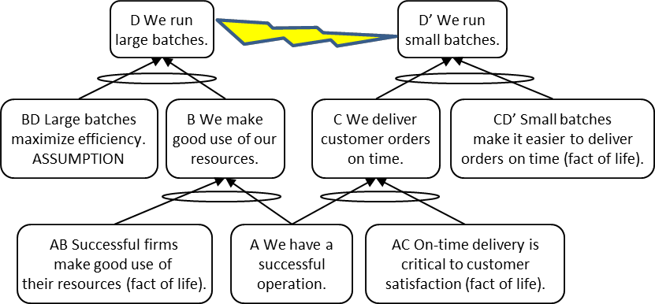

См.: [[подход с тремя облаками]].

#shortcut

#tocico

## three-cloud approach

<b>three-cloud approach</b> -  A relatively fast method of developing a current reality tree (CRT) wherein the developer identifies three seemingly independent undesirable effects (UDEs), creates an evaporating cloud (EC) for each, and synthesizes the three ECs into a single generic cloud called the core conflict cloud (CCC). 

Usage: The three-cloud approach uses assumptions underlying each of the entity pair relationships (A-B, A-C, B-D, C-D' and D-D') in the CCC together with the CCC itself to form the base for a CRT by: 1. rotating the CCC 90 degrees counter-clockwise,  2. modifying the wording of the entities slightly, 3. reversing the direction of the arrows, 4. adding any necessary assumptions to provide sufficiency to the logic,  5. including transitional, fact-of-life entities as necessary, and  6. building upward to the UDEs for the system being analyzed. 

Illustration: The base of a CRT created using the three-cloud approach is shown below: 

Caution: Some critics feel that using the three cloud approach may not lead to a core problem while other feel that this criticism is overcome by the proper selection of UDEs (from diverse functions).

See:[[core conflict cloud]], [[core driver]], [[current reality tree]], [[evaporating cloud]], [[fact of life]], [[logic diagram]], [[transitional entity]], [[undesirable effect]].
