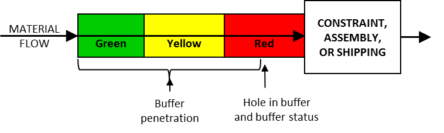

### Инъекция летающей свиньи (flying pig injection)

**Инъекция летающей свиньи (flying pig injection)** - разговорный термин, используемый для описания прорывного раствора или инъекции, которые изначально кажутся невозможными.

Перспектива: инъекция летающей свиньи названа так потому, что ее настолько сложно реализовать, что она имеет почти нулевую вероятность появления, как и увидеть летающую свинью.

Иллюстрация: получение кредита в размере 100 миллионов долларов для финансирования разработки нового, непатентованного продукта для 25-летнего недавнего выпускника инженерного факультета будет рассматриваться почти всеми как инъекция летающей свиньи.

См.: [[прорывная инъекция]], [[инъекция]], [[первичная инъекция]].

#мп

#translated
