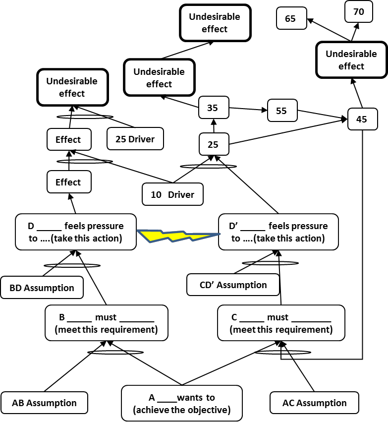

### аналогия изменений (change analogy)

**аналогия изменений (change analogy)** - Картинка ниже используется для описания двух новых процессов согласия (*покупки, принятия решения*), основанных на более подробном перечне уровней сопротивления: плюс-плюс и минус-минус.

В процессе согласия (*покупки, принятия решения*) «плюс-плюс» у человека есть выбор: подняться на гору, чтобы получить большой горшок с золотом (плюс изменения), или оспорить свое пребывание там, где он / она, чтобы поддерживать отношения с окружающими. русалка (плюс не меняется).

Напротив, в процессе покупки минус-минус у человека есть выбор: быть съеденным крокодилом, если он / она не изменится (минус неизменности), ), или упасть с горы и сломать ногу. нужен костыль (минус менять).

Использование: Основная идея процесса согласия «плюс-плюс» заключается в том, что потенциальная выгода (горшок с золотом) от изменения намного, намного больше, чем потенциальная выгода от отсутствия изменений (русалка). Он основан на том факте, что большой «горшок с золотом» может быть значительным мотиватором для многих людей внести необходимые изменения, особенно если можно показать, что либо русалки на самом деле не существует, либо русалка гораздо менее важна, чем горшок с золотом, или, в некоторых случаях, вы можете взять с собой русалку.

См.: [[процесс согласия]], [[процесс согласия минус-минус]], [[процесс согласия плюс-плюс]].

#парадигма

*Примечание АВ: Можно сравнить с Декартовыми вопросами из коучинга:*

[]{#t.eedf9a70baf0f58609e17b6267db4d6ccf648e9a} []{#t.0}

  --------------------------------------------------------------- -----------------------------------------------------------------
  *Что Хорошего (плюс) случится если менять (горшок с золотом)*   *Что плохого (минус)  случится если менять. (сломать ногу)*
  *Что Хорошего (плюс) случится если не менять  (русалка)*        *Что плохого (минус)  случится если НЕ менять (крокодил съест)*
  --------------------------------------------------------------- -----------------------------------------------------------------

#translated
