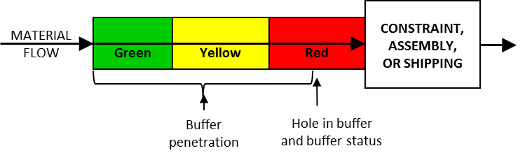

### буфер времени (time buffer)

**буфер времени (time buffer)** - Защита от неопределенности, которая принимает форму времени. Буферы ограничений, сборки и отгрузки, используемые в планировании барабана-буфера-каната, и производственный буфер, используемый в упрощенном барабане-буфере-канате, являются примерами временных буферов.

Иллюстрация: Временной буфер для заказа на выполнение работ:

См.: [[буфер сборки]], [[буфер]], [[буфер мощности]], [[барабан-буфер-канат]], [[буфер барабана]], [[питающий буфер]], [[буфер проекта]], [[буфер доставки]].

См.: [[буфер мощности]].

Синоним: [[time buffer]].

#translated
