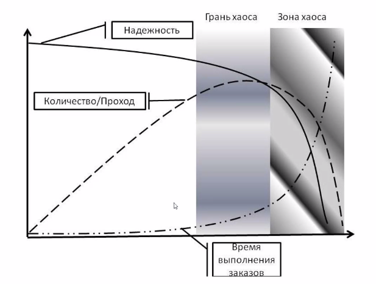

### буфер мощности (capacity buffer)

**буфер мощности (capacity buffer)** - буфер мощности (термин, устоявшийся в русском языке)

1. При управлении проектами критической цепочки для нескольких проектов - временной буфер, помещаемый в план проекта непосредственно перед первым использованием ресурса барабана,  чтобы защитить начало проекта от вариаций (Мерфи) от задач барабана  (*задач на барабане*)  в восходящих (*предшествующих*) проектах .

Использование

1: буфер мощности обеспечивает ускорение проекта, если ресурс барабана доступен раньше. Буферы емкости используются только в средах с несколькими проектами.

2. В среде производство для наличия - дополнительная емкость ресурса с ограниченной емкостью или других сильно загруженных ресурсов, которая доступна быстро и по разумной цене (возможно, через субподряд) для реагирования на внезапное увеличение общего спроса.

См.: [[буфер]], [[управление проектами критической цепи]], [[барабан]], [[ресурс-барабан]], [[производство-для-наличия]].

#производство

#ccpm

*Примечание АВ: На иллюстрации,  перед 189 задачей стоит буфер емкости, защищающий ресурс ограничения после 214 .  А перед 214 стоит защита от предыдущего проекта*

*Примечание АВ: (практикум 27.08.2021) Количество скиллов которые можешь выдать. Количество полезной работы которое МОЖЕТ быть выполнено за определенный период времени на ресурсе-ограничении.*

*Мощность не существует в людях. Она всегда пересчитывается в часы.*

*Пример: буфер времени - прямой запас времени.*

*Буфер  - защита от неопределенности: время, пространство, мощность. С бесконечном времени - бесконечная мощность ь. Мощность - функция времени.*

*Э.Ш.: Буфер мощности - возможность привлечения дополнительную мощность за дополнительные деньги. Когда загрузка барабана будет подбираться к пределу*

*Если слишком много в красном - мы подходим к грани хаоса за которой происходит обрушение системы.*

*Вариант буфера мощности для Цепи: Планирование по заниженной производительности.*

Синоним: [[capacity buffer]].

#translated
