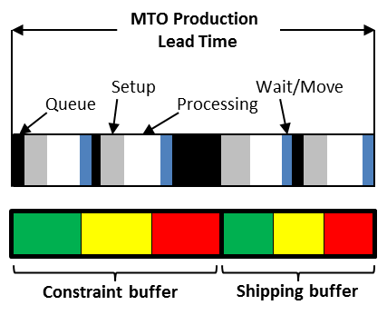

### буфер ограничения (constraint buffer)

**буфер ограничения (constraint buffer)** - смещение буфера времени, используемое для планирования выпуска материалов, которые питают ограничение.

Использование: Если ограничение существует в производстве, буфер ограничения и буфер доставки (а иногда и буфер сборки) используются для защиты вывода системы. Если ограничение присутствует на рынке, буфер ограничения не нужен, и используется только буфер доставки. Буфер ограничения не используется в упрощенном барабане-буфере-веревке. Размер буфера ограничений задан таким образом, чтобы значительно снизить вероятность того, что изменение в системе до ограничения приведет к «истощению» ограничения,   (т. е. не иметь того, что необходимо для удовлетворения потребительского спроса), но не приведет к чрезмерным запасам незавершенного производства.

Перспектива: подход TOC к буферизации ограничения является основным отличием от многих других подходов к управлению производством. Это различие важно, потому что, если есть ограничение в операциях, этот буфер позволяет системе более полно использовать это ограничение, тем самым увеличивая пропускную способность.

Иллюстрация: буфер ограничения для производственной ситуации на заказ показан ниже:

См.: [[буфер]], [[управление буфером]], [[буфер доставки]].

#ббк

[учет ограничений (constraints accounting)]{.c19 .c4}

Синхронизация: учет пропускной способности.

Синоним: [[constraint buffer]].

#translated
