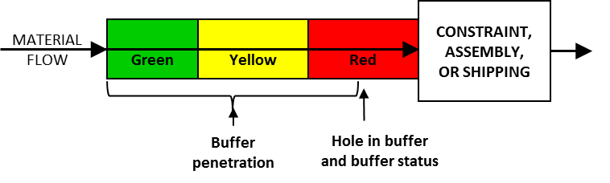

### буферные области (buffer regions)

**буферные области (buffer regions)** - Буфер (время, запас и т. д.) разделен на отдельные сегменты, чтобы указать на необходимость упреждающих действий для предотвращения опоздания детали / продукта / человека или истощения ограничений. Регионы

обычно называются красной, желтой и зеленой областями и обычно составляют 1/3 от общего размера буфера каждая, хотя относительный размер может отличаться в зависимости от конкретных характеристик технологического потока и продукта. Иногда термин «белая область» используется для обозначения заказов, которые были выпущены раньше срока (досрочно), а термин «черная область» используется для обозначения поздних заказов. Верхний рисунок иллюстрирует области буфера запаса, а нижний рисунок - области временного буфера.

Иллюстрация 1. Области складского буфера для детали или продукта.

Иллюстрация 2: Временной буфер для заказа.

Синоним: [[буферные зоны]].

См.: [[буфер]], [[управление буфером]].

#производство

#ббк

Синоним: [[buffer regions]].

#translated
