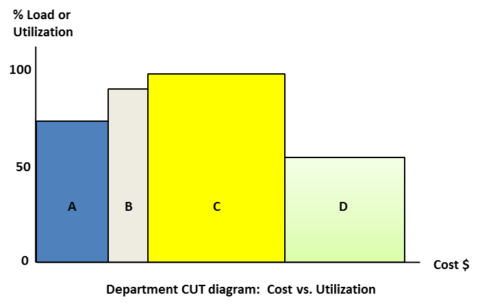

### ветвь текущей реальности (current reality branch, CRB)

**ветвь текущей реальности (current reality branch, CRB)** - сегмент дерева текущей реальности, обеспечивающий причинно-следственную связь от основной проблемы или низшей сущности или причины к одному или нескольким НЖЯ.

См.: [[дерево текущей реальности]].

#мп

Синоним: [[current reality branch]].

#translated
