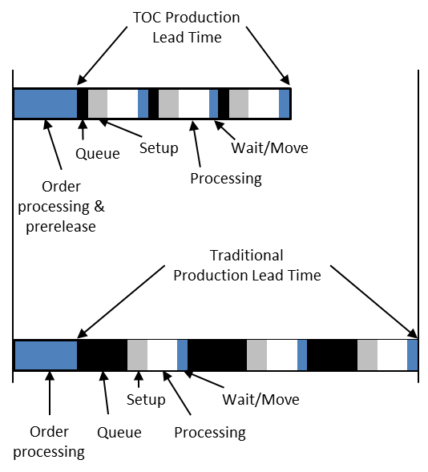

### время производственного цикла (production lead time)

**время производственного цикла (production lead time)** - (ВПЦ, PLT) - общее время с момента, когда производственный заказ передается в цех, до момента, когда заказ будет готов к отгрузке (изготовление на заказ) или размещению готовой продукции (изготовление до готовности). PLT состоит из:

1. времени ожидания машины для выполнения рабочего задания (ресурс, необходимый для следующей операции, занят, и существует очередь рабочих заданий для обработки);

2. Время подготовки назначенной машины к обработке конкретного рабочего задания;

3. Время обработки - фактическое время работы над материалом;

4. Время ожидания и перемещения возникает, когда заказ выполнен в одном рабочем центре и его необходимо переместить в другой рабочий центр; и

5. Защитное время для покрытия неожиданных и незапланированных действий, например, «Мерфи».

Использование: Время выполнения заказа (время обработки заказа клиента у производителя) и время предварительного выпуска (время до выпуска в цех) предшествуют времени выполнения ТОС. Размещение в запасах готовой продукции в среде «изготовление до готовности» знаменует собой окончание производственного цикла. Отгрузка клиенту в условиях производства на заказ знаменует собой окончание производственного цикла.

Иллюстрация: На первой диаграмме ниже показано время производства ТОС, а на второй --- время выполнения заказа в традиционной производственной среде. В традиционном производстве после завершения обработки заказа производственный заказ передается в цех независимо от текущей нагрузки на цех. Таким образом, очереди и, следовательно, время производственного цикла значительно увеличиваются.

См.: [[полное время пополнения]].

Синоним: [[production lead time]].

#translated
