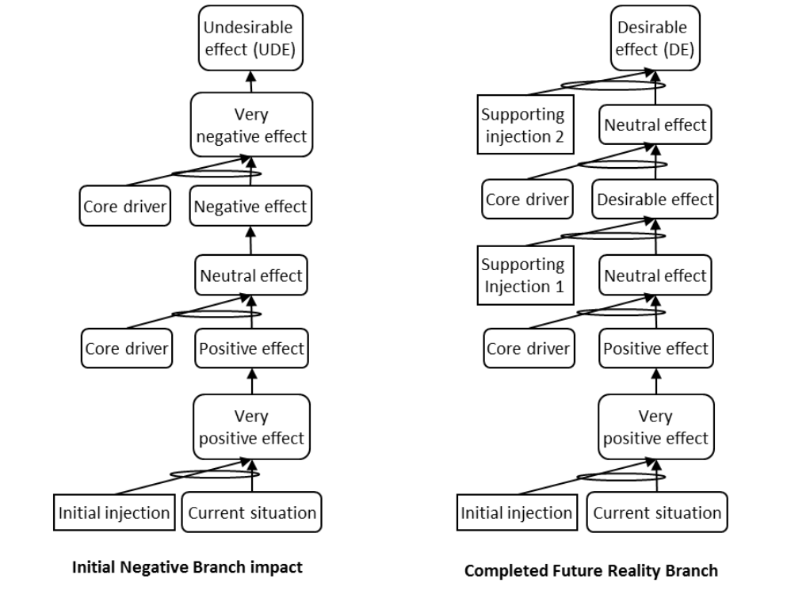

### встроенный конфликт (embedded conflict)

**встроенный конфликт (embedded conflict)**  - ситуация, в которой одно из требований к испаряющемуся облаку может рассматриваться как цель второго облака на более низком уровне системы, с теми же противоположными действиями D и D \'в конфликте на более низком уровне.

Иллюстрация:

Синоним: [[вложенный конфликт]].

#мп

#translated
