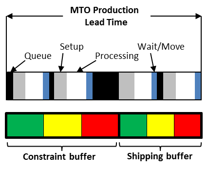

### выравнивание ответственности и полномочий

**выравнивание ответственности и полномочий** **(alignment of responsibility and authority**) - этот хорошо известный принцип организационного поведения является первичной инъекцией в испаряющееся облако лейтенанта *(подчиненного)*, или облако конфликта, при управлении человеческим поведением. Шаблон лейтенантского облака представлен ниже. Инъекция в лейтенантское облако - это правильное совмещение ответственности и власти. Чтобы построить лейтенантское облако для конфликта мировоззрения, ответьте на вопросы в каждом поле.

Иллюстрация: в этой сюжетной линии компания в прошлом сталкивалась с проблемами, когда несколько человек внутри компании говорили напрямую с клиентом. Была установлена политика, согласно которой только менеджер по работе с клиентами может разговаривать с клиентом. Однако случилось так, что менеджер по работе с клиентами был недоступен, когда менеджеру по отгрузке нужно было задать клиенту вопрос о заказе, который нужно было отправить немедленно, иначе было бы поздно. Менеджер по отгрузке (лейтенант) отвечал за своевременную доставку заказа, но не имел полномочий связаться с клиентом, чтобы получить информацию, необходимую для выполнения его / ее обязанностей. Как показано в облаке ниже, инъекция для испарения этого облака дает лейтенанту право связаться с клиентом, когда это оказывает прямое влияние на его или ее способность выполнять обязанности по доставке в срок.

См.: [[предположение]], [[испаряющееся облако]], [[инъекция]], [[лейтенантское облако]].

#парадигма

#translated
