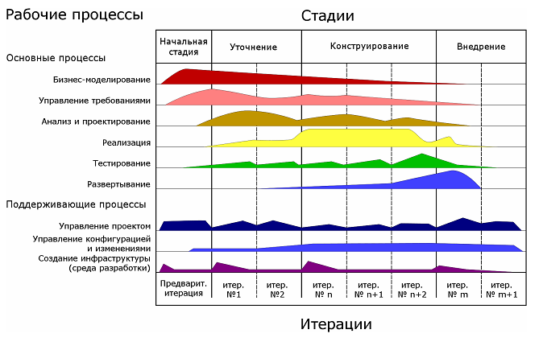
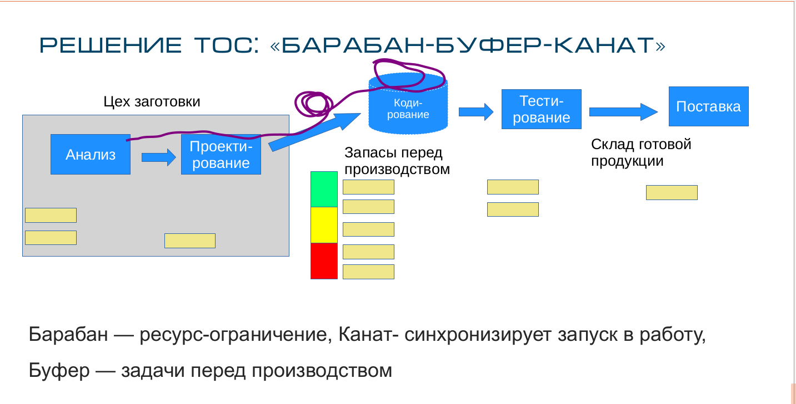

### голодание (starvation)

**голодание (starvation)** - В TOC - условие бездействия ограничения из-за отсутствия материала для обработки.

Использование: В традиционном производстве голодание применяется ко всем рабочим центрам; Напротив, в системе барабан-буфер-веревка основное внимание уделяется предотвращению голодания в ограничении, потому что голодание в ограничении приводит к потере пропускной способности. Ограничение защищено от голодания буфером между ограничением и вышестоящими рабочими центрами.

Три источника потери пропускной способности в барабанно-буферно-канатной системе: голодание, засорение (засор) и обрыв связи.

См.: [[засор]], [[поломка]].

#производство

*Примечание АВ: В ИТ-проектах, когда проект уже запущен аналитик нужен на 20-30% доступной мощности. Картинка из RUP*

Поэтому Аналитиков нагружают другим проектами. Им нужно понять как переключаться между проектами чтобы ресурс-ограничение (разработчики) не голодал. И при этом они смогли быстро отвечать на вопросы разработчиков. Для этого работает буфер запасов перед ограничением (барабан).

Синоним: [[starvation]].

#translated
