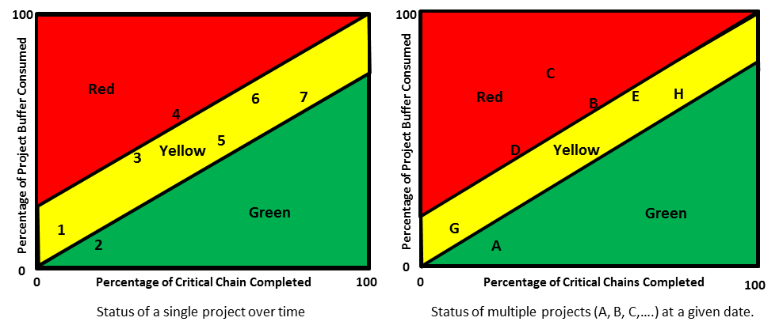

### график температур (fever chart)

**график температур (fever chart)** - график, показывающий состояние проекта или нескольких проектов. График показывает процент использования буфера проекта по вертикальной оси и процент завершенной критической цепочки по горизонтальной оси. Красный, желтый и зеленый цвета обозначают статус проекта.

Использование: Один из подходов к рисованию регионов заключается в следующем: если скорость сжигания буфера меньше 1.0, статус проекта будет зеленым. Если скорость сжигания буфера составляет приблизительно 1,0, статус проекта желтый. Если скорость записи буфера больше 1, статус проекта красный. Менеджер проекта отвечает за определение границ желтой зоны.

Иллюстрация 1: График слева внизу отражает статус отдельного проекта. Точки (1, 2, 3....) Представляют даты отчетов о состоянии (например, еженедельно) с течением времени.

Иллюстрация 2: График справа внизу отражает статус нескольких проектов. Точки (A, B, C...) представляют состояние различных проектов в данный момент времени.

Внимание: состояние буфера (красный, желтый или зеленый), отображаемое на графике температур, может отличаться от состояния буфера, отраженного процентами буферной области (красная, желтая и зеленая границы).

См.: [[скорость сжигания буфера]], [[меры управления проектом]].

Синоним: [[диагональный буфер]].

#ccpm

Синоним: [[fever chart]].

#translated
