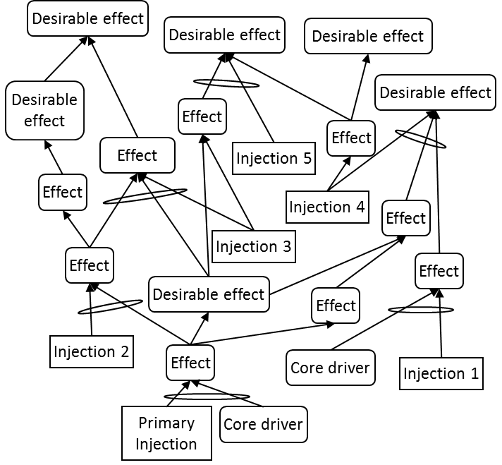
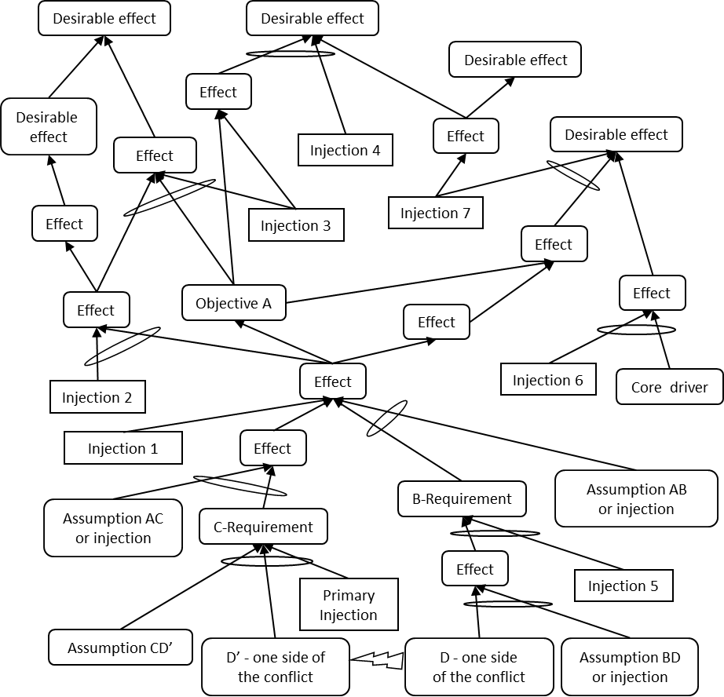

### дерево реальности будущего (future reality tree, FRT, ДБР)

**дерево реальности будущего (future reality tree, FRT, ДБР)** - логическая схема, основанная на достаточности мыслительных процессов, которая помогает ответить на вопрос (из последовательности вопросов об изменении): «На что изменить?» путем представления последовательности причинно-следственных связей, которые связывают предлагаемые инъекции с желаемыми эффектами (ЖЭ).

Использование: ДБР создается до внесения каких-либо изменений в систему. Цели ДБР:

1. логически продемонстрировать, что выбранная инъекция или инъекции вместе с любыми вторичными или поддерживающими инъекциями и их связанные эффекты приведут к замене большинства существующих НЖЯ в системе на ЖЭ; а также

2. Выявление и предотвращение возникновения любых новых проблем или НЖЯ, которые могут возникнуть в результате внедрения предложенных инъекций. Последняя цель достигается за счет процесса отсечения негативных ветвей.

Есть два метода построения дерева будущей реальности. Первоначальный метод начинался с инъекции в нижнюю часть дерева и наращивался вверх для достижения желаемого эффекта. Более свежий метод запускает дерево реальности будущего с испаряющегося облака, повернутого на 90 градусов по часовой стрелке. Предположения, лежащие в основе каждой стрелки облака, используются вместе с инъекциями, разработанными из облака, чтобы нарастить до желаемых эффектов.

Иллюстрация 1: Дерево реальности будущего, построенное с использованием традиционного подхода, показано ниже:

Иллюстрация 2: Дерево реальности будущего, построенное с использованием испаряющегося облака в качестве основы, показано ниже:

См.: [[последовательность вопросов Изменения]], [[желаемый эффект]], [[сущность]], [[процесс отсечения негативных ветвей]], [[логика основанная на достаточности]], [[прогнозируемый нежелательный эффект]].

#мп

Синоним: [[future reality tree]].

#translated
