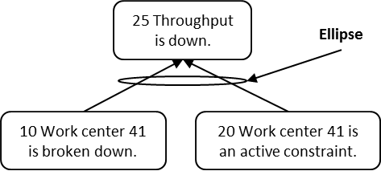

### дерево текущей реальности (current reality tree, ДТР)

**дерево текущей реальности (current reality tree, ДТР)** - логическая диаграмма, основанная на достаточности мыслительных процессов, которая помогает ответить на вопрос (из последовательности вопросов об изменении): «что изменить?», иллюстрируя причинуи взаимосвязь между основной проблемой и нежелательными эффектами (НЖЯ) в системе.

Использование: ДТР использует логику «если .., то \...» для представления непрерывных цепочек причинно-следственных связей от основной проблемы или основного конфликта вверх до нежелательных последствий. В нём также представлены последовательности объектов, которые отображают системные политики, ведущие к измерениям, которые, в свою очередь, вызывают нежелательное поведение.

ДТР часто используется, когда:

1. неясно, как реализовать один или несколько из пяти основных шагов, или

2. у группы улучшения системы возникают проблемы с получением управленческой поддержки предлагаемых изменений.

Понимая, почему существуют НЖЯ, команда по улучшению системы может разработать набор вмешательств или инъекций для устранения основной проблемы и, следовательно, большинства наиболее значительных нежелательных эффектов.

Существует два подхода к разработке текущего дерева реальности - традиционный подход, который начинается со списка UDE и связывает их с помощью причинно-следственной логики, и подход с тремя облаками, который начинается с трех испаряющихся облаков, из которых развивается типичное облако, которое становится основой для ДТР.

Иллюстрация 1: Пример ДТР, разработанного с использованием традиционного подхода:

Иллюстрация 2: Пример ДТР, разработанного с использованием подхода трех облаков:

См.: [[одобрение (buy-in)]], [[изменение последовательности вопросов]], [[основной конфликт]], [[основная проблема]], [[внедрение]], [[логика основанная на достаточности]], [[процессы мышления]], [[подход с тремя облаками]], [[нежелательные эффекты]], [[что изменить?]].

#мп

#translated
