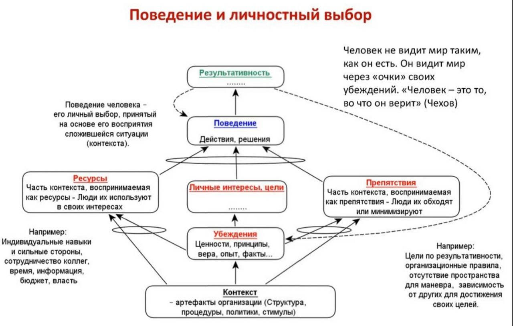

### достаточно хорошая кривая (good enough curve)

**достаточно хорошая кривая (good enough curve)** - Вогнутая кривая с относительно плоской вершиной с целевыми единицами (например, чистая прибыль, пропускная способность или счастье) на вертикальной оси или оси Y и переменной решения (например, количество открытых проектов, заказы, выпущенные для обработки или уровень многозадачности) по горизонтальной оси. Кривая состоит из трех фаз: слишком мало, достаточно хорошо и слишком много переменной решения.

Использование:

В левой части кривой изображено влияние слишком малого количества переменных решения (например, слишком мало открытых проектов или заказов). Эффект этого уровня переменной решения - небольшое количество единиц цели (например, пропускная способность мала из-за отсутствия ограничения).

В средней или плоской части кривой единиц цели относительно стабильны в широком диапазоне переменной решения.

Правая часть кривой показывает влияние на единицы цели слишком высоких значений переменной решения. Важны три момента:

1. Не существует единого оптимального решения для переменной решения для достижения максимальных единиц цели. Эта концепция противоречит академическому поиску оптимального решения для многих ситуаций. Вместо этого существует широкий диапазон значений переменной решения, обеспечивающий одинаково приемлемое количество единиц цели.

2. Одна из основных концепций теории ограничений заключается в том, что менеджеры должны стремиться разработать достаточно хорошее решение проблемы, а затем буферизовать решение, чтобы минимизировать риск того, что запланированные единицы цели не будут достигнуты.

3. В первой фазе (то есть в левой части кривой) ограничивающим фактором является недостаточная работа, в то время как в третьей фазе (правая часть кривой) ограничивающим фактором является слишком большая работа, что вызывает путаницу, ресурс конфликты и многозадачность с последующим падением производительности.

В реальной ситуации исследователь мог бы идентифицировать нежелательные последствия текущей ситуации и затем мог бы, используя причинно-следственную логику (логическая ветвь или ДТР), сказать, где на кривой находится организация. Если нежелательные эффекты вызваны слишком малым количеством переменной решения, применяется большее количество переменной решения. Если нежелательные эффекты относятся к слишком большой части переменной решения, то переменная решения обычно уменьшается на 25% (например, 25% открытых проектов замораживаются). Это действие обычно приводит организацию к достаточно хорошей области диаграммы. Затем можно использовать управление буфером для постоянного совершенствования решения.

Иллюстрация:

Синоним: [[кривая плато]].

См.: [[u-кривая]].

#парадигма

#translated
