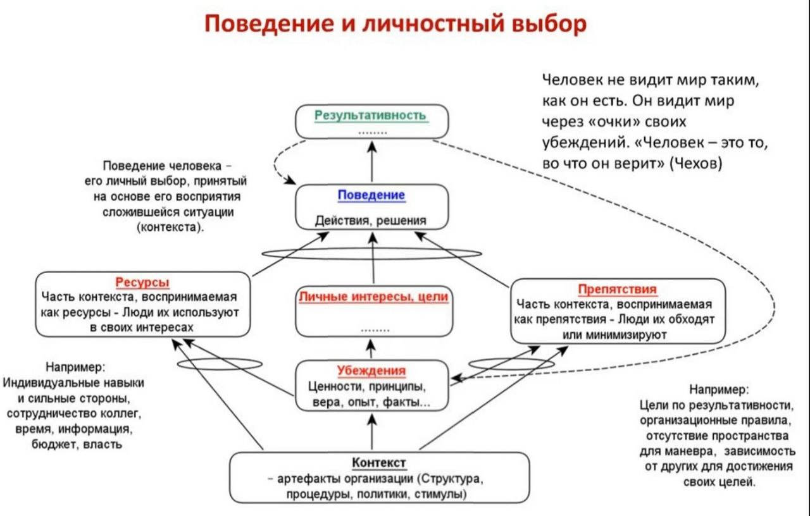

### исключающее обозначение \'или\' (exclusive \'or\' designator)

**исключающее обозначение \'или\' (exclusive \'or\' designator)** - символ, использующий слово ИЛИ, заключенное в \"\<\>\" (т. е. \<ИЛИ\>), который при размещении между двумя причинами одного следствия означает взаимоисключающие причины. Если поместить между причинами одного следствия, это означает, что если одна причина случается, то другая причина нет.

Иллюстрация 1: Исключительное ИЛИ (причина)

Иллюстрация 2: Исключающее ИЛИ (эффект)

См.: [[соединитель «и»]].

#мп

#translated
