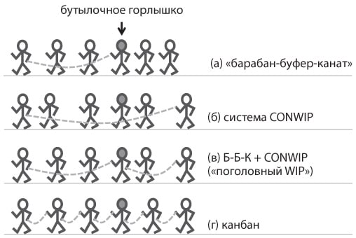

### канат (rope)

**канат (rope)** - одно из трех устройств, необходимых для правильного управления операциями. (Два других --- это барабан и буфер.) Поток информации от барабана к началу процесса ограничивает выпуск материалов (в производство), чтобы соответствовать потоку через ограничение.

См.: [[буфер]], [[барабан]], [[барабан-буфер-канат]], [[упрощенный барабан-буфер-канат]].

Примечание АВ:

Это фрагмент из книги по Канбан-методу,

-   [вариант А - веревка - буфер запасов перед ограничением сдергивает]{.c1}
-   [вариант Б - последовательное исполнение проектов в Методе управления Проектным бизнесом Pulse Management. обеспечивает максимальную фокусировку.]{.c1}
-   [вариант В - это обычная производственная система, первая веревка - буфер материалов перед ограничением, вторая веревка - буфер запасов для наличия.]{.c1}

Сравнение с Канбан-методом: [Точность прогнозов защищается буфером!!]{.c6 .c5}

#производство
#ббк
Синоним: [[rope]]. [[барабан-буфер-канат]]

#translated
