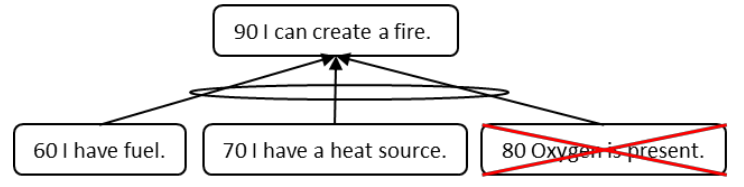

### кислород (oxygen)

**кислород (oxygen)** - Предположение, которое обычно не документируется на диаграмме, основанной на достаточности мыслительных процессов, потому что всем известно, что оно существует и везде принимается как элемент реальности.

Иллюстрация: Вербализуется следующая логическая схема:

-   [Если 60 у меня есть топливо ]{.c0}
-   [и 70 у меня есть источник тепла, ]{.c0}
-   [то 90 я могу разжечь огонь. ]{.c0}

Кислород также должен присутствовать, но кислород есть везде, где мы находимся, поэтому мы обычно предполагаем, что кислород доступен, и нет необходимости документировать его на нашей логической диаграмме, основанной на достаточности.

См.: [[предположение]], [[жизненный факт]], [[логика]], [[основанная на достаточности]], [[мыслительные процессы]].

#мп

Синоним: [[oxygen]].

#translated
