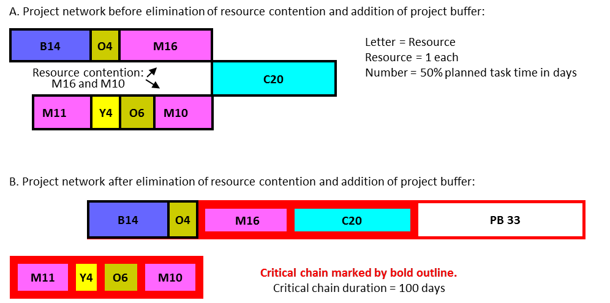

### конфликт ресурсов (resource contention)

**конфликт ресурсов (resource contention)** -

1. В производстве - ситуация, при которой два или более рабочих задания требуют одного и того же ресурса одновременно.

Использование 1: В производстве конфликт ресурсов может быть выявлен на этапе планирования барабан-буфер-канат и на этапе выполнения производственных решений либо барабан-буфер-канат, либо упрощенный барабан-буфер-канат.

Перспектива 1: если данный рабочий центр загружен на 80 %, то примерно 80 % времени, когда рабочее задание поступает в этот рабочий центр, ресурс будет занят другой частью.

2. В управлении проектами - ситуация, в которой две или более задач в одном проекте или между проектами должны выполняться одним и тем же ресурсом, а сроки выполнения задач совпадают.

Использование 2: В управлении проектами конфликт ресурсов может быть выделен на этапе планирования при определении критической цепи, а также после вставки питающих буферов, что потенциально может создать конкуренцию между питающими задачами (задачами питающей цепи) и между питающими задачами и задачами критической цепи. Конфликт может возникнуть в рамках одного проекта, между проектами или когда задача проекта конфликтует с повседневными задачами. На этапе выполнения проекта может возникнуть конфликт ресурсов, когда несколько задач ожидают выполнения одним и тем же ресурсом одновременно.

Иллюстрация 2: В сети проекта, показанной ниже, задачи M16 и M10 требуют ресурса M одновременно. На диаграмме A показана сеть проекта до устранения конфликта ресурсов, а на диаграмме B показан тот же проект после устранения конфликта ресурсов:

#ccpm

Синоним: [[resource contention]].

#translated
