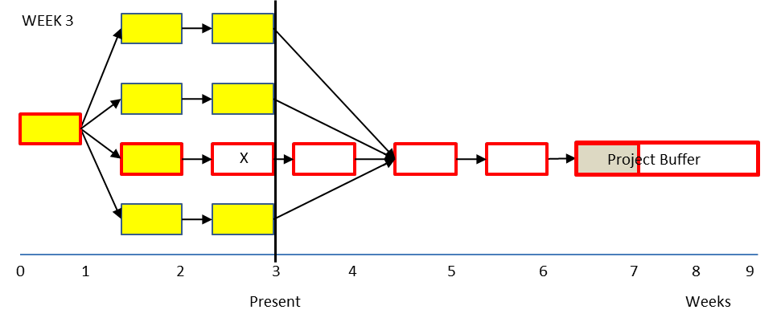

### критическая цепь завершена (critical chain completed percentage)

**критическая цепь завершена (critical chain completed percentage)** - показатель прогресса проекта. Первая мера из набора из трех мер в управлении буфером для управления проектами критической цепи одного и нескольких проектов

Критическая цепь завершена (%) =         100%  x (количество дней завершения работы CC) / (общее количество дней в критической цепочке )

Использование: Цель расчета процента завершенной критической цепи  состоит в том, чтобы сосредоточить внимание на проблемах, которые ставят под угрозу выполнение задач критической цепочки и, таким образом, влияют на выполнение сроков.

Иллюстрация: В приведенной ниже сети проекта критическая цепь  длится шесть недель (задачи выделены жирными линиями) и две недели (задачи выделены светом). Критическая цепь завершена на 33% (100% х 2 недели / 6 недель). Прогресс проекта 33%. Чтобы определить, хорошо это или плохо, необходимо рассчитать второй и третий меры, скорость сжигания буфера и скорость потребления буфера проекта.

Синоним: [[ход проекта]].

См.: [[скорость сжигания буфера]], [[скорость потребления буфера проекта]], [[меры управления проектом]].

#ccpm

*Примечание АВ: Другими словами, прогресс критической цепи проекта рассчитывается на основе оценочных дней на выполнение работ по задачам, а не на основе выполненных штук задач.*

Синоним: [[critical chain completed percentage]].

#translated
