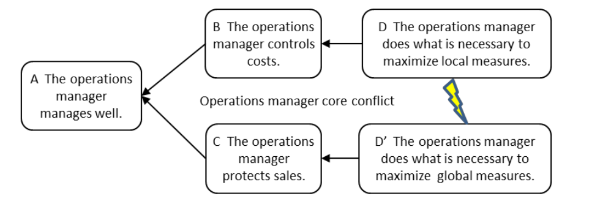

### максимизация эффективности

НО **максимизация эффективности** приводит к увеличению незавершенного производства, что увеличивает время выполнения заказа и тормозит поток, тем самым ставя под угрозу продажи. ТОС-решение этого конфликта заключается в использовании целостных правил управления цехом: барабан-буфер-веревка (упрощенно барабан-буфер-веревка) и управление буфером.

См.: [[традиционная философия управления производством]].

#производство

*Примечание АВ: эта туча актуальна для физического производства, тут есть скрытая предпосылка что незавершенное производство это "Инвестиции" и "замороженный капитал". Для ИТ-проектов это может быть не так.*

Синоним: [[максимизация эффективности]].

#translated
