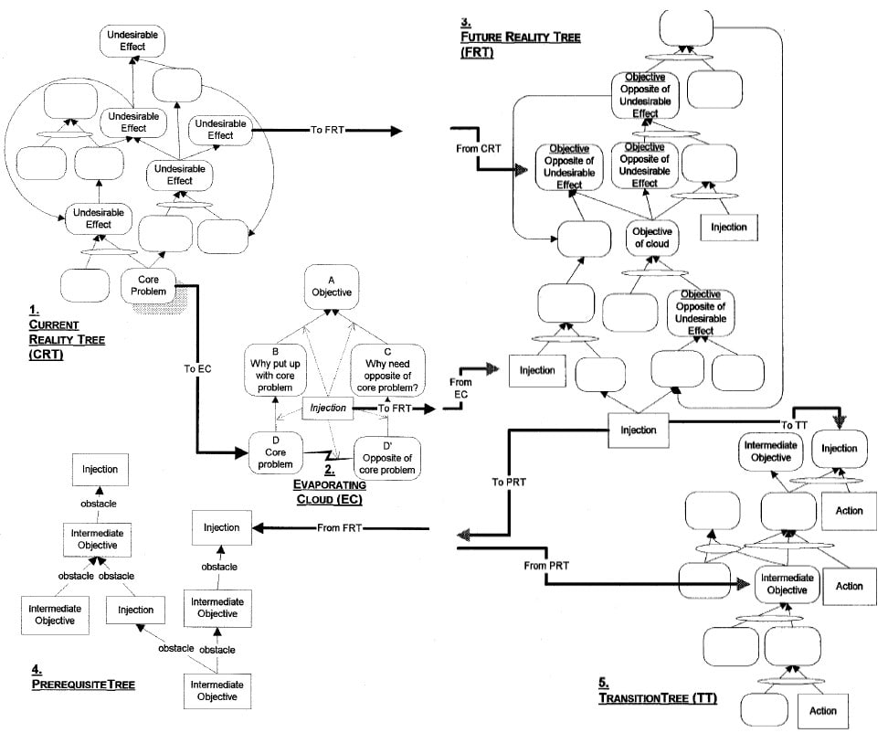

### мыслительные процессы (thinking processes)

**мыслительные процессы (thinking processes)** - (TP) - Набор логических инструментов, которые могут использоваться независимо или в комбинации для решения вопросов в последовательности вопросов об изменении для управления текущими улучшениями. Мыслительными процессами являются:

-   [дерево текущей реальности (ветвь будущей реальности, веточка будущей реальности, current reality tree (branch, twig)), ]{.c0}
-   [испаряющееся облако (evaporating cloud), ]{.c0}
-   [дерево будущей реальности (ветвь будущей реальности, веточка будущей реальности), ]{.c0}
-   [отсечение отрицательных ветвей (future reality tree (branch, twig)),]{.c0}
-   [дерево предварительных условий (дерево предпосылок, русский перевод Детмера: "дерево перехода", prerequisite tree),]{.c0}
-   [карта промежуточных целей (intermediate objectives map), ]{.c0}
-   [дерево перехода (русский перевод Детмера: "План перехода", transition tree) и ]{.c0}
-   [дерево стратегии и тактики (strategy and tactics tree).]{.c0}

Использование: Мыслительные процессы могут быть использованы для анализа как простых, так и сложных систем, выявления и решения системных проблем, а также преодоления уровней сопротивления и достижения поддержки со стороны отдельных лиц и различных групп заинтересованных сторон по мере необходимости. Кроме того, они могут быть использованы для построения стратегии организации.

#мп

Синоним: [[thinking processes]].

#translated
