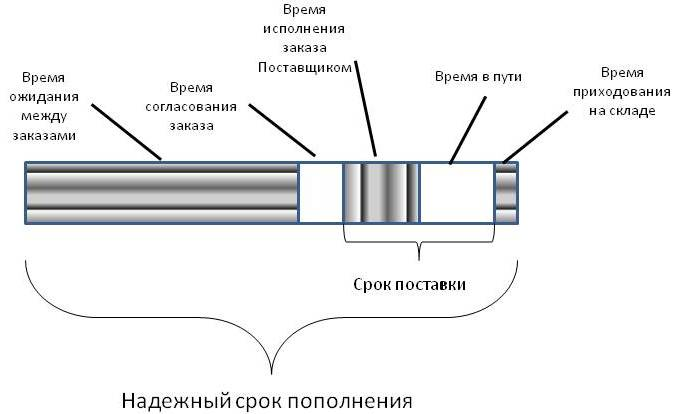

### надежное время пополнения (reliable replenishment time)

**надежное время пополнения (reliable replenishment time)** - время, в течение которого деталь может быть надежно (80-95% времени без ускорения) получена в случае крайней необходимости.  

Синоним: [[время надежного пополнения]].

#производство

*Примечание АВ: Равен   время между заказами + Lеad time.*

*Время между заказами = ожидание накопления минимальной партии + сумма остальных расходов времени на работу с заказом.*

Синоним: [[reliable replenishment time]].

#translated
